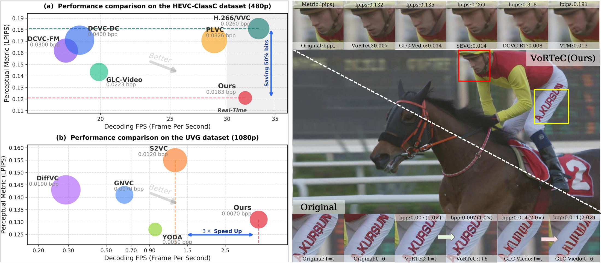
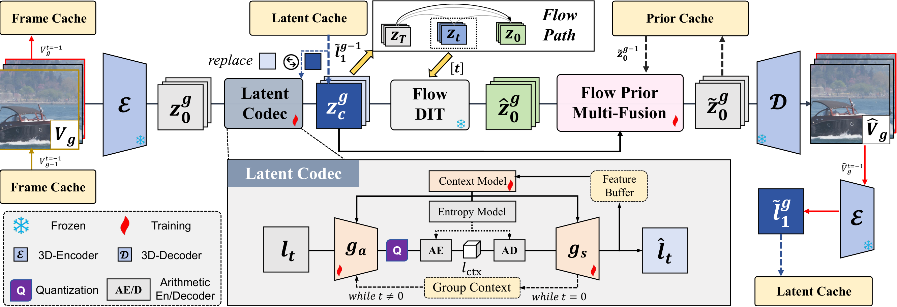
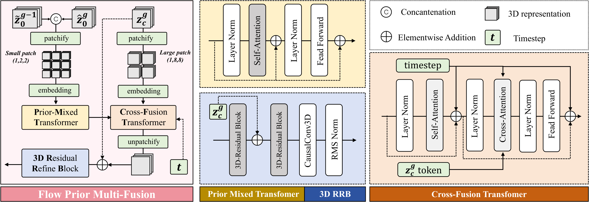
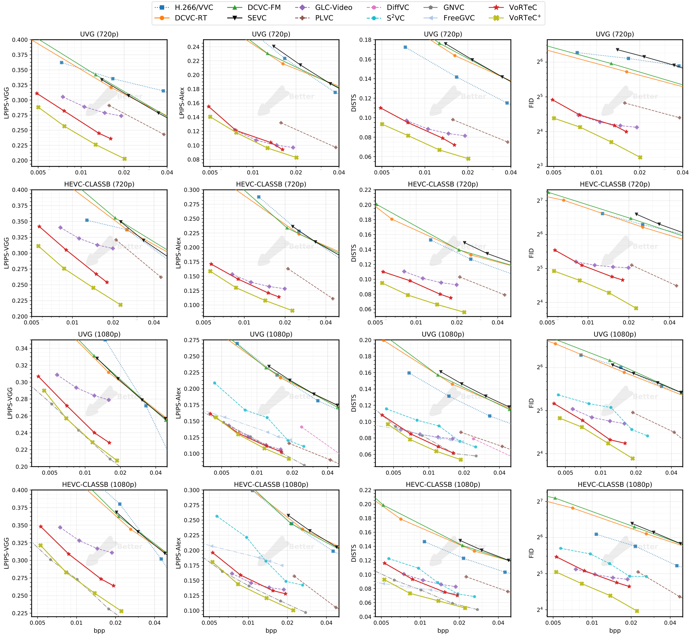
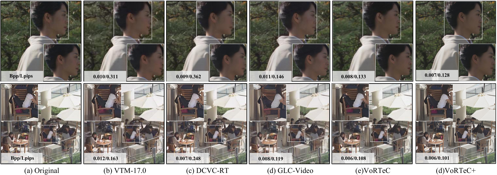
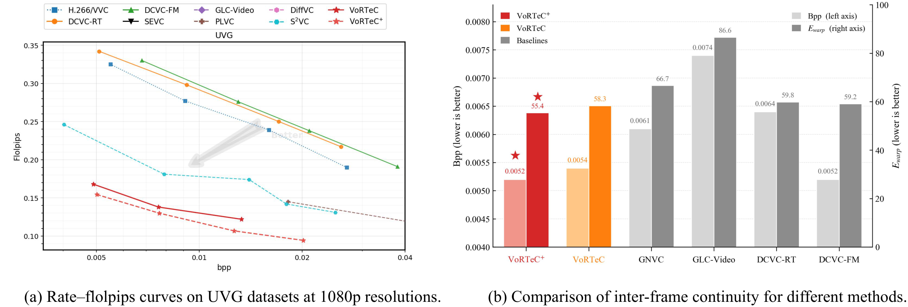

<div align="center">

# VoRTeC: Taming Foundation Flow for One-step Real-time Video Compression

[](http://arxiv.org/abs/2609.02291)
[](./LICENSE)
[](https://www.python.org)
[](https://pytorch.org)
[](https://github.com/Wan-Video/Wan2.1)
[](#-release-status)
[](https://github.com/Darc8-sun/VoTec-video-compression/)

<p align="center">
  <a href="http://arxiv.org/abs/2609.02291"><b>Paper</b></a> ·
  <a href="https://darc8-sun.github.io/VoRTec_compress/"><b>Project Page</b></a> ·
  <a href="#-method-overview">Method</a> ·
  <a href="#-results">Results</a> ·
  <a href="#-citation">Citation</a>
</p>


</div>

---

> **TL;DR** &nbsp; VoRTeC is the **first one-step generative video codec** built on top of a **video-native flow-matching foundation model** (Wan2.1). It tames a billion-parameter DiT into a single decoding step without touching its weights or gradients, achieving **58–73% bitrate savings** over prior diffusion-based codecs **and** decoding speeds up to **3–197× faster**, reaching **32 FPS at 480P** and **3.93 FPS at 1080P**.

<p align="center">
  
</p>

## 📢 News

- **[2026-09-23]** &nbsp; 🚀 **Full code release** — The full inference and evaluation pipeline, pre-trained weights, and model inference results are available in this repository as open source.
- **[2026-09-02]** &nbsp; 🎉 Initial repository created with the **partial open-source release** accompanying the arXiv preprint.
- **[2026-09-02]** &nbsp; 📝 Paper released on arXiv (http://arxiv.org/abs/2609.02291).
- **[Coming]** &nbsp; 🔓 The complete entropy encoding and decoding pipeline and the checkpoints for the VoRTeC (no lora) will be open-sourced in the near future.

## ✨ Highlights

| | |
|---|---|
| ⚡ **Real-time decoding** | **32 FPS @ 480P** · **13 FPS @ 720P** · **3.93 FPS @ 1080P** on a single A800 |
| 📉 **Bitrate savings** | **58.12–73.25%** LPIPS BD-Rate over prior diffusion-based video codecs |
| 🔁 **Speedup over diffusion-based baselines** | **3×–197×** faster decoding |
| 🚫 **Non-invasive to backbone** | Wan2.1 weights & gradients are **never accessed** during training |
| 🧩 **Single-step decoding** | No iterative flow-matching sampling — one forward pass of the foundation model |

## 🧠 Method Overview

<p align="center">
  
  <br>
  <em>Overall pipeline of VoRTeC. A frozen 3D encoder/decoder ℰ/𝒟 from Wan2.1 produces a spatio-temporal latent; a lightweight <strong>Latent Codec</strong> compresses it; a <strong>Flow State Estimator</strong> projects the compressed latent onto the flow path; the frozen <strong>Flow DiT</strong> performs a single-step denoising; and a Transformer-based <strong>Flow Prior Multi-Fusion (FPMF)</strong> module refines the reconstruction and enables end-to-end learning of the prior distribution.</em>
</p>

VoRTeC comprises three core technical ingredients:

1. **Flow-State Estimation (FSE).** &nbsp; Treats each compressed latent as a state along the foundation flow's trajectory and solves for the optimal timestep .
2. **Flow Prior Multi-Fusion (FPMF).** &nbsp; A ViT-based module that fuses coarse-grained compressed tokens with fine-grained prior tokens using **multi-scale patchification** — coarse patches capture low-frequency structure, fine patches attend to high-frequency textures.
3. **Contact-Group-to-Group (CGG).** &nbsp; A *training-free* inter-group caching mechanism that routes the **last frame** of each group into the **first frame** of the next via latent-cache, frame-cache and prior-cache, guaranteeing **temporal consistency** across GOPs without any extra supervision or inference overhead.

<p align="center">
  
  <br>
  <em>Figure: Architecture of the Flow Prior Multi-Fusion module.</em>
</p>

## 📊 Results

### Rate–distortion / Rate–perception curves

<p align="center">
  
</p>

VoRTeC consistently outperforms prior **neural**, **generative**, and **traditional** video codecs on HEVC ClassB (720P / 1080P) and UVG (720P / 1080P). With LoRA fine-tuning, **VoRTeC⁺** further extends the gains to **64.53%–74.80%** LPIPS BD-Rate savings.

### Decoding throughput

Encoding / decoding FPS on a single NVIDIA A800 (VTM-17.0 evaluated on an Intel Xeon Gold 6330):

| Method          | 416×240   | 832×480   | 1280×720  | 1920×1080 |
|-----------------|-----------|-----------|-----------|-----------|
| VTM-17.0        | 0.47 / 121.73 | 0.12 / 56.62 | 0.08 / 36.92 | 0.02 / 12.35 |
| DCVC-DC         | 36.24 / 43.88 | 15.63 / 18.71 | 7.47 / 9.36 | 3.43 / 4.36 |
| DCVC-FM         | 36.51 / 43.09 | 16.82 / 17.85 | 7.58 / 8.94 | 3.51 / 4.22 |
| GLC-Video       | 49.39 / 57.22 | 28.60 / 19.92 | 13.25 / 8.82 | 6.36 / 4.19 |
| DiffVC          | 0.85 / 0.88 | 0.29 / 0.29 | 0.09 / 0.09 | 0.02 / 0.02 |
| GNVC-VD         | —          | < 40 / < 7.75 | 17.24 / 2.59 | 6.54 / 0.64 |
| S2VC            | —          | —          | —          | 6.60 / 1.27 |
| YODA            | —          | —          | —          | — / 0.97  |
| **VoRTeC (Ours)** | **84.46 / 105.25** | **20.34 / 32.31** | **8.76 / 12.60** | **3.84 / 3.93** |

> Format: *encoding FPS / decoding FPS*. **Higher is better.**

### Qualitative comparison

<p align="center">
  
</p>

### Temporal consistency

<p align="center">
  
</p>

Across both FloLPIPS (optical-flow-aware perceptual distance) and warping error `E_warp` (inter-frame continuity), VoRTeC consistently outperforms diffusion-based baselines and even matches or beats distortion-oriented neural codecs.

## 🛠️ Installation

```bash
# 1. Clone this repository
git clone https://github.com/Darc8-sun/VoTec-video-compression.git
cd VoTec-video-compression

# 2. Create a fresh environment
conda create -n vortec python=3.10 -y
conda activate vortec

# 3. Install Python dependencies
pip install -r requirements.txt
#    Optional: flash-attention for faster inference.
#    wan/modules/attention.py degrades gracefully when it is absent.
pip install flash-attn --no-build-isolation

# 4. Download the Wan2.1-1.3B foundation model (backbone + VAE)
pip install "huggingface_hub[cli]"
huggingface-cli download Wan-AI/Wan2.1-T2V-1.3B \
    --local-dir ./checkpoints/Wan2.1-T2V-1.3B

# 5. Place the VoRTeC codec checkpoint under ./checkpoints/vortec/
#    (see "Checkpoints" below for the required state-dict keys)

# 6. Prepare the YUV test sets under ./datasets/
#    (see "Dataset Preparation" below for the expected layout)
```

> **Hardware** &nbsp; A single NVIDIA GPU with ≥ 24 GB memory (we develop on an A6000 / A800) is sufficient for evaluation.

## 📦 Checkpoints

| Component | Expected path | Source |
|---|---|---|
| Wan2.1-1.3B DiT (flow backbone) | `./checkpoints/Wan2.1-T2V-1.3B/` | ✅ [🤗 Wan-AI/Wan2.1-T2V-1.3B](https://huggingface.co/Wan-AI/Wan2.1-T2V-1.3B) |
| Wan2.1 VAE (3D causal VAE) | `./checkpoints/Wan2.1-T2V-1.3B/Wan2.1_VAE.pth` | ✅ same repo as above |
| **VoRTeC codec checkpoint** | `./checkpoints/vortec/VoRTeC_xxx.pt` | ✅  **https://pan.quark.cn/s/8c6b4ee35b40?pwd=yHcg** |
| Text context tensor | `./checkpoints/txt_context_tensor.pt` | ✅ bundled in this repository |

**About `txt_context_tensor.pt`.** This is a pre-baked T5 text embedding (shape `[43, 4096]`, `bfloat16`) for the fixed conditioning prompt. Shipping it lets you run inference **without** loading the T5 text encoder, saving both VRAM and time. It is loaded once and reused across all videos.

## 🗂️ Dataset Preparation

Place the raw `.yuv` files under a root directory (default `./datasets`, configurable via `dataset_root` in the YAML):

```
datasets/
├── UVG/                       # 1920x1080, yuv420p, 8-bit
│   ├── Beauty_1920x1080_120fps_420_8bit_YUV.yuv
│   └── ...
├── HEVC-B/                    # 1920x1080, yuv420p, 8-bit
│   ├── BasketballDrive_1920x1080_50.yuv
│   └── ...
├── MCL/                       # 1920x1080, yuv420p, 8-bit
│   └── *.yuv
└── HEVC-C/                    # 832x480, yuv420p, 8-bit
    └── *.yuv
```

| `dataset_name` | Sub-directory | Resolution |
|---|---|---|
| `UVG` | `<dataset_root>/UVG` | 1920×1080 |
| `HEVC_CLASSB` | `<dataset_root>/HEVC-B` | 1920×1080 |
| `MCL_JCV` | `<dataset_root>/MCL` | 1920×1080 |
| `HEVC_CLASSC` | `<dataset_root>/HEVC-C` | 832×480 |

> ⚠️ The loader scans **only one level deep** (`<dir>/*.yuv`, non-recursive) and expects planar `yuv420p`, 8-bit input whose geometry **exactly matches** the table above — a mismatch will silently read the wrong strides.

## 🚀 Usage

```bash
# 1. Prepare the YUV test sets       -> ./datasets/
# 2. Download the checkpoints        -> ./checkpoints/
# 3. Edit every path in test_codec_config.yaml to match your setup
python test_codec.py --config test_codec_config.yaml
# Only inference for bpp and reconstructed videos is supported at present; the encoding and decoding functionalities will be released later.
```

### Configuration reference (`test_codec_config.yaml`)

| Field | Required | Default | Description |
|---|---|---|---|
| `dataset_name` | ✅ | — | One of `UVG`, `HEVC_CLASSB`, `MCL_JCV`, `HEVC_CLASSC` |
| `dataset_root` | — | `./datasets` | Root directory holding the per-dataset YUV sub-folders |
| `ckpt_path` | ✅ | — | VoRTeC codec checkpoint file (takes precedence over `ckpt_dir`) |
| `ckpt_dir` | — | `null` | Directory to auto-search `best.pt` in |
| `model_name` | — | `null` | Tag used in output filenames; inferred from the checkpoint path when `null` |
| `vae_path` | ✅ | — | Wan2.1 VAE weights (`.pth`) |
| `flow_model_path` | ✅ | — | Wan2.1-1.3B DiT directory (diffusers format) |
| `context_path` | ✅ | — | Text-context tensor; use the bundled `./txt_context_tensor.pt` |
| `num_pred_groups` | ✅ | — | Number of P-groups per meta-group; a meta-group is `9 + 8 × num_pred_groups` frames (paper uses `2` → 25 frames) |
| `output_dir` | ✅ | — | Directory for decoded tensors and videos |
| `device` | ✅ | — | e.g. `cuda` |
| `use_lora` | — | `false` | Enable VoRTeC⁺ (checkpoint must contain `flow_lora_state_dict`) |
| `lora_rank` | — | `8` | LoRA rank (only when `use_lora: true`) |
| `lora_alpha` | — | `1.0` | LoRA scaling (only when `use_lora: true`) |
| `save_video` | — | `false` | Also export a reconstructed `.mp4` |
| `video_save_idx` | — | `0` | Which video index to export (only when `save_video: true`) |
| `use_ain` | — | `false` | Apply adaptive instance normalization for colour alignment |

## 📁 Repository Structure

```
VoTec-video-compression/
├── test_codec.py               # Entry point: config -> dataset -> models -> per-group decode
├── test_codec_config.yaml      # The only configuration file
├── codec_utils.py              # FSE, CGG caches, dataset factory, model loading, decode_group
├── txt_context_tensor.pt       # Pre-baked T5 text context (43 x 4096, bfloat16)
├── requirements.txt
├── LICENSE
│
├── Vtc_compressor/             # Latent Codec
│   ├── new_igc.py              #   LatentCodec (I-Group / P-Group)
│   ├── ckbd.py                 #   Checkerboard entropy context
│   ├── compressor_module.py    #   Convolution / feature-extractor blocks
│   └── module/
│       ├── layers.py           #   Depthwise residual blocks, sub-pixel convs
│       └── stream_helper.py    #   Padding and state-dict helpers
│
├── Vtc_module/                 # Generative prior modules
│   ├── Prior_refinement.py     #   FPMF (Prior_refine_DIT)
│   └── lora.py                 #   VoRTeC+ LoRA injection / extraction
│
├── Vtc_utils/                  # Utilities
│   ├── yuv_video_dataset.py    #   Raw YUV reader -> RGB tensor dataset
│   ├── utils_tool.py           #   AIN colour alignment, quantization, distributions
│   └── video_metrics_test.py   #   PSNR / LPIPS / DISTS / FloLPIPS wrappers
│
├── wan/                        # Upstream Wan2.1 (Apache-2.0)
├── compressai/                 # Upstream CompressAI (BSD-3-Clause-Clear)
└── assets/                     # Figures used in this README
```

## 🙏 Acknowledgements

This project builds on the following outstanding open-source work:

- **[Wan2.1](https://github.com/Wan-Video/Wan2.1)** — the video-native flow-matching foundation model that powers VoRTeC (Apache-2.0).
- **[CompressAI](https://github.com/InterDigitalInc/CompressAI)** — entropy models, transforms and arithmetic-coding primitives (BSD-3-Clause-Clear).

We sincerely thank the authors of these works for open-sourcing their code and models.

## 📚 Citation

If you find VoRTeC useful for your research, please cite our work. The BibTeX entry will be updated upon acceptance; a placeholder is provided below:

```bibtex
@misc{xia2026vortectamingfoundationflow,
      title={VoRTeC: Taming Foundation Flow for One-step Real time Video Compression}, 
      author={Yichong Xia and Qinhong Wu and Bin chen and Jinpeng Wang and Zeyuan Chen and Haoqian Wang},
      year={2026},
      eprint={2609.02291},
      archivePrefix={arXiv},
      primaryClass={cs.CV},
      url={https://arxiv.org/abs/2609.02291}, 
}
```

The full bibliographic information will be added once the paper is accepted.

## 📬 Contact

For questions about the code or the paper, please open an issue on this repository, or contact `xiayc23@tsinghua.edu.cn` / `chenbin2021@hit.edu.cn`.

## 📄 License

This repository is released under the [Apache License 2.0](./LICENSE).

Note that several third-party components are bundled as sub-directories and retain their original licenses:

| Component | License | Upstream |
|---|---|---|
| `wan/` | Apache 2.0 | github.com/Wan-Video/Wan2.1 |
| `compressai/` | BSD 3-Clause Clear | github.com/InterDigitalInc/CompressAI |

---

<div align="center">
  ⭐ Star this repo if you find VoRTeC useful — it helps us prioritize the full open-source release.
</div>
